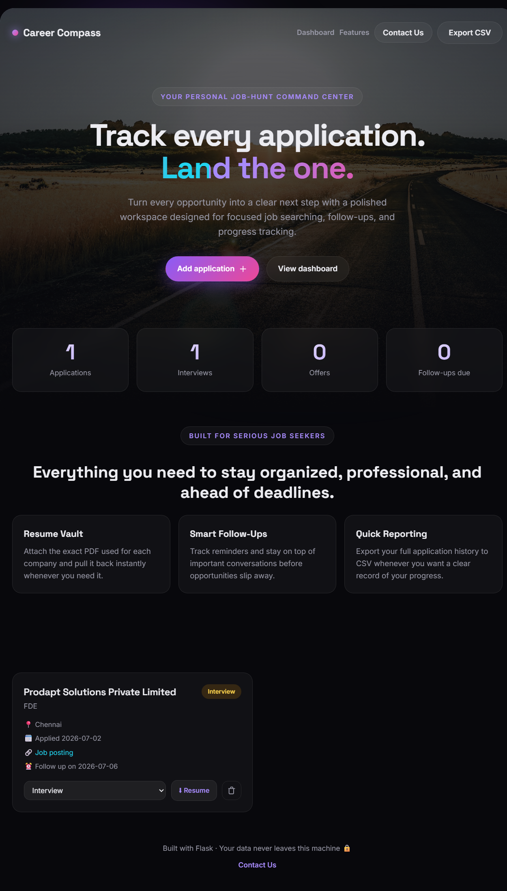

# Career Compass

Career Compass is a polished, animated job application tracker designed to help job seekers stay organized, professional, and ahead of every deadline. It lets you manage applications, attach the exact resume used for each opportunity, track follow-ups, and export your data when needed.



## Features

- Add and manage job applications with company, role, date, status, location, job link, and notes
- Attach and download the exact resume PDF used for each application
- Track application progress through Applied, Online Assessment, Interview, Offer, Accepted, and Rejected
- Receive follow-up reminders for overdue tasks
- Search and filter applications quickly
- Export your full tracker data to CSV
- Open a Contact Us section for development issues and improvement suggestions

## Tech stack

- Backend: Flask
- Database: SQLite
- Frontend: HTML, CSS, and vanilla JavaScript
- Deployment: Render-ready with Gunicorn and render.yaml

## Local setup

```bash
pip install -r requirements.txt
python server.py
```

Then open http://localhost:5000 in your browser.

## Render deployment

This project is prepared for Render deployment using:

- gunicorn for production serving
- render.yaml for a simple web service configuration

### Deploy steps

1. Push this repository to GitHub.
2. Create a new Web Service in Render.
3. Connect the GitHub repository.
4. Render will use the included render.yaml configuration.
5. Deploy and open the generated Render URL.

## Project structure

```text
career-compass/
├── server.py
├── templates/
├── static/
├── requirements.txt
├── render.yaml
└── data/                 # created on first run
```

## Contact

For development issues, feature requests, or improvements, contact:

- Gowrabathuni Mohit Tej
- mohittejgowraa@gmail.com

## Privacy note

Your data stays on the local machine by default. The data folder stores the SQLite database and uploaded resume files locally unless you later move to cloud storage for a public deployment.
